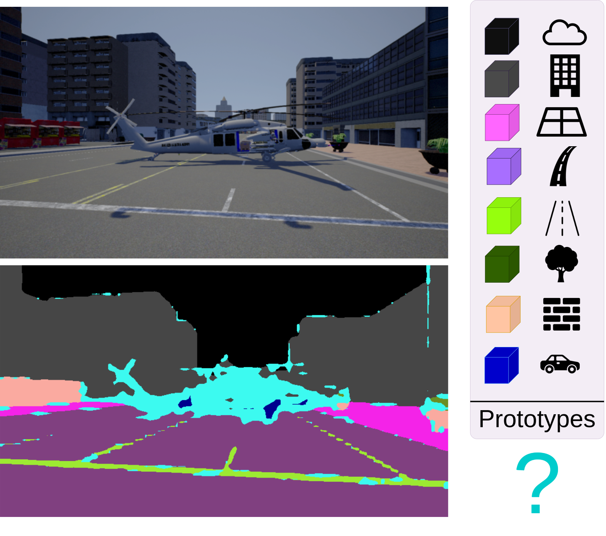

# Detecting Anomalies in Semantic Segmentation with Prototypes

This is the official code implementation of the paper **"Detecting Anomalies in Semantic Segmentation with Prototypes"** by Dario Fontanel, Fabio Cermelli, Massimiliano Mancini and Barbara Caputo accepted at **SAIAD** CVPRW 2021.

[[article]](https://openaccess.thecvf.com/content/CVPR2021W/SAIAD/papers/Fontanel_Detecting_Anomalies_in_Semantic_Segmentation_With_Prototypes_CVPRW_2021_paper.pdf)


In this paper, we address Anomaly Segmentation through prototype learning, where the anomalies (light-blue) are all regions unmatched with any class prototype learned by the model.

## Installation
To clone the repository:

```bash
cd ~
git clone https://github.com/DarioFontanel/PAnS.git
```

This repository uses the following libraries:
- Python (3.8.5)
- Pytorch (1.6.0)
- Torchvision (0.7.0)
- InPlaceAbn (1.0.12)
- Matplotlib (3.3.1)
- Numpy (1.19.1)
- Tensorboard (2.2.1)
- tqdm (4.50.2)

To facilitate the installation of all the dependencies, the requirement file is provided in `~/PAnS/docs`.

## Data preparation
- Download StreetHazards dataset following this [repo](https://github.com/hendrycks/anomaly-seg).
- Download InPlaceAbn pretrained weights following this [repo](https://github.com/mapillary/inplace_abn#training-on-imagenet-1k). ResNet50 InPlaceAbn pretrained weights can be also downloaded [here](https://drive.google.com/drive/folders/1i7aufwaEJHfNcmuQ3ouxcDsvxdZo1ucz?usp=sharing). 

Note that the pretrained weights are made on multiple-gpus with [DDP](https://pytorch.org/docs/stable/notes/ddp.html). 
In this repo DDP is used as well, but the model is firstly instantiated without 
DPP. So, please be sure to remove the DDP prefix *module.* contained in each key of weights 
dictionary before running the code. To accomplish this, simply rename each model key using `key = key[7:]`. 

Moreover, if you do not want to use pretrained weights, use `--no-pretrained`. 

The final directory should look like as follows:
```
~/PAnS/
   |----data/
       |----StreetHazards
             |----train/
                    |----annotations
                    |----images
                    |----train.odgt
             |----validation/
                    |----annotations
                    |----images
                    |----validation.odgt
             |----test/
                    |----annotations
                    |----images
                    |----test.odgt
             |----color150.mat

    |----pretrained/
            |----resnet50_iabn_sync.pth.tar
```
 
## Pipeline
#### Training
To train PAnS with default parameters use:
```bash
cd ~/PAnS
python3 -m torch.distributed.launch --master_port {port} --nproc_per_node={gpu} run.py --name {name} --default
```
where
* ```{gpu}``` is the number of available GPUs
* ```{port}``` is the available port for [DDP](https://pytorch.org/docs/stable/notes/ddp.html).
* ```{name}``` is the name of the experiment 

#### Evaluation
Results and training statistics can be evaluated on tensorboard plots by running
```bash
cd ~/PAnS
tensorboard --logdir logs/ --bind_all
```

## Cite us
If you use this repository, please consider to cite

```
@inproceedings{fontanel2021detecting,
  title={Detecting Anomalies in Semantic Segmentation with Prototypes},
  author={Fontanel, Dario and Cermelli, Fabio and Mancini, Massimiliano and Caputo, Barbara},
  booktitle={Proceedings of the IEEE/CVF Conference on Computer Vision and Pattern Recognition},
  pages={113--121},
  year={2021}
}
```

___
For any additional information or requests, please contact [Dario Fontanel](mailto:dario.fontanel@polito.it) at ***dario.fontanel AT polito.it***.
